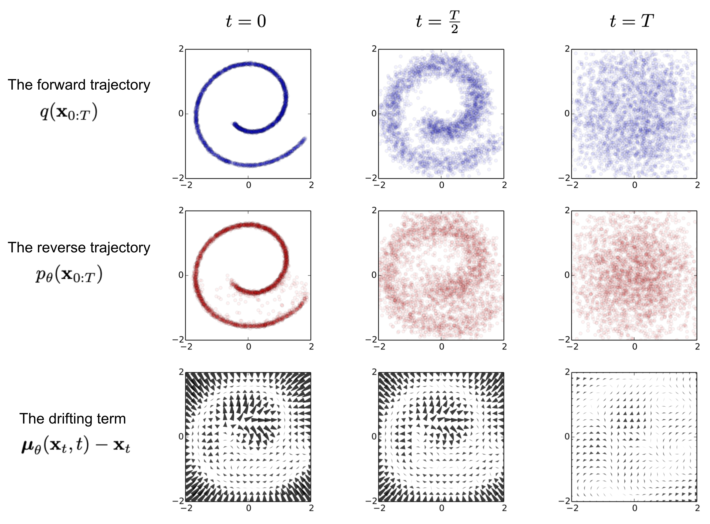
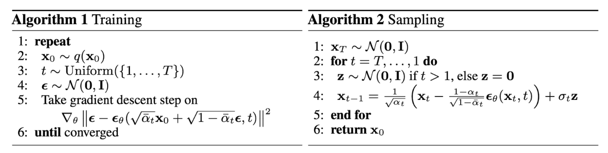
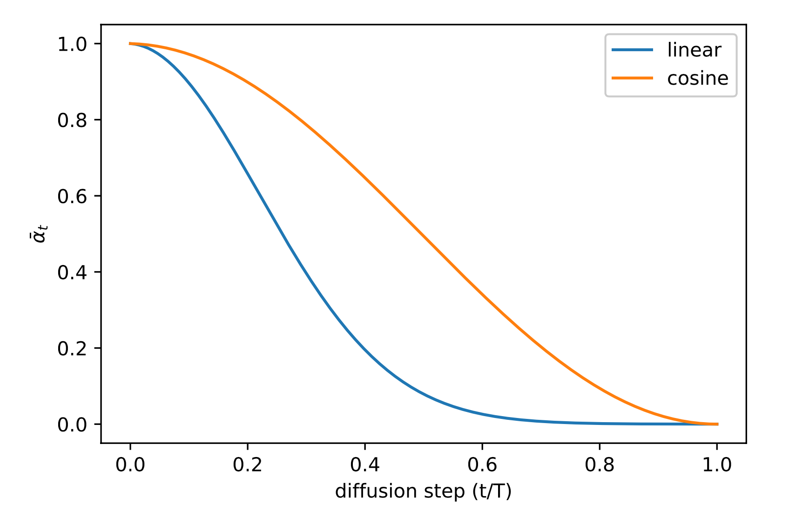
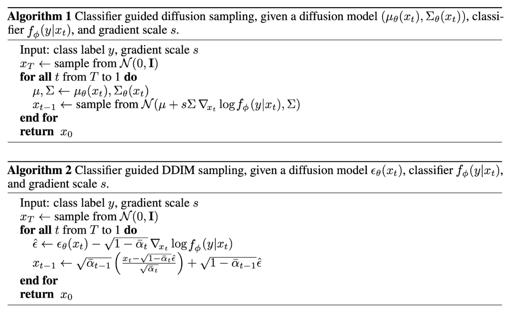
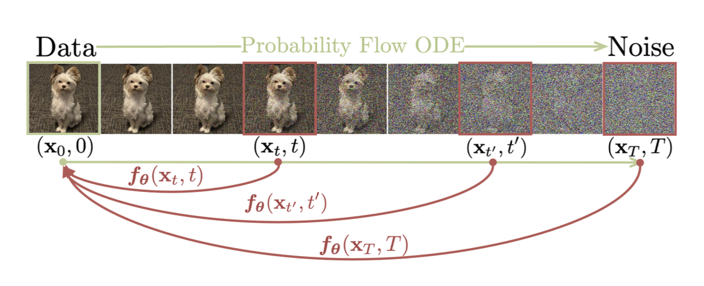
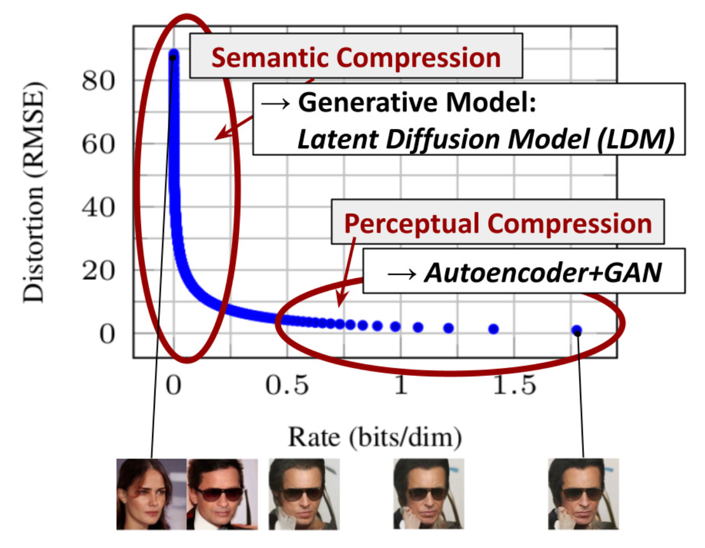
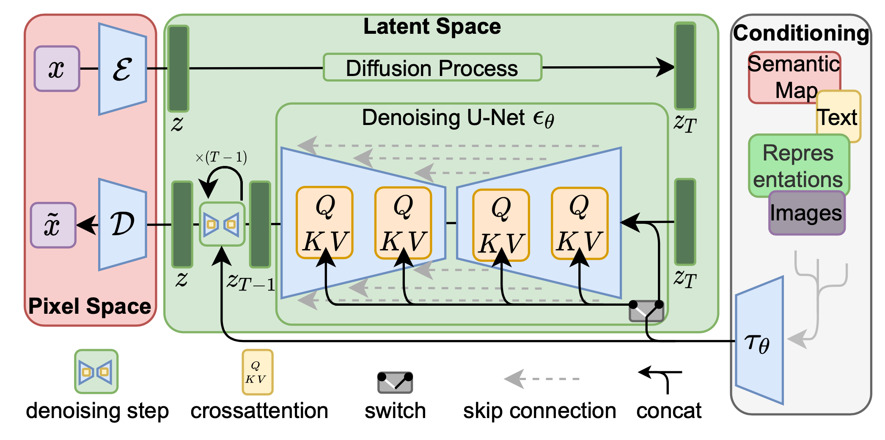
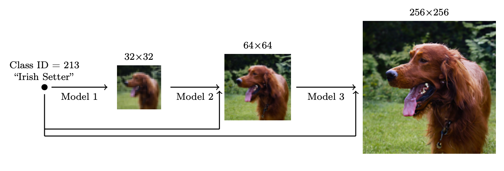

# What are Diffusion Models?

Date: July 11, 2021 | Estimated Reading Time: 31 min | Author: Lilian Weng

Table of Contents

- [What are Diffusion Models?](#what-are-diffusion-models)
  - [What are Diffusion Models?#](#what-are-diffusion-models-1)
    - [Forward diffusion process#](#forward-diffusion-process)
      - [Connection with stochastic gradient Langevin dynamics#](#connection-with-stochastic-gradient-langevin-dynamics)
    - [Reverse diffusion process#](#reverse-diffusion-process)
    - [Parameterization of $L\_t$ for Training Loss#](#parameterization-of-l_t-for-training-loss)
      - [Simplification#](#simplification)
      - [Connection with noise-conditioned score networks (NCSN)#](#connection-with-noise-conditioned-score-networks-ncsn)
    - [Parameterization of $\\beta\_t$#](#parameterization-of-beta_t)
    - [Parameterization of reverse process variance $\\boldsymbol{\\Sigma}\_\\theta$#](#parameterization-of-reverse-process-variance-boldsymbolsigma_theta)
  - [Conditioned Generation#](#conditioned-generation)
    - [Classifier Guided Diffusion#](#classifier-guided-diffusion)
    - [Classifier-Free Guidance#](#classifier-free-guidance)
  - [Speed up Diffusion Models#](#speed-up-diffusion-models)
    - [Fewer Sampling Steps \& Distillation#](#fewer-sampling-steps--distillation)
    - [Latent Variable Space#](#latent-variable-space)
  - [Scale up Generation Resolution and Quality#](#scale-up-generation-resolution-and-quality)
  - [Model Architecture#](#model-architecture)
  - [Quick Summary#](#quick-summary)
  - [Citation#](#citation)
  - [References#](#references)

[Updated on 2021-09-19: Highly recommend this blog post on [score-based generative modeling](https://yang-song.github.io/blog/2021/score/) by Yang Song (author of several key papers in the references)].  
[Updated on 2022-08-27: Added [classifier-free guidance](#classifier-free-guidance), [GLIDE](#glide), [unCLIP](#unclip) and [Imagen](#imagen).  
[Updated on 2022-08-31: Added [latent diffusion model](#ldm).  
[Updated on 2024-04-13: Added [progressive distillation](#prog-distll), [consistency models](#consistency), and the [Model Architecture section](#model-architecture).

So far, I’ve written about three types of generative models, [GAN](https://lilianweng.github.io/posts/2017-08-20-gan/), [VAE](https://lilianweng.github.io/posts/2018-08-12-vae/), and [Flow-based](https://lilianweng.github.io/posts/2018-10-13-flow-models/) models. They have shown great success in generating high-quality samples, but each has some limitations of its own. GAN models are known for potentially unstable training and less diversity in generation due to their adversarial training nature. VAE relies on a surrogate loss. Flow models have to use specialized architectures to construct reversible transform.

Diffusion models are inspired by non-equilibrium thermodynamics. They define a Markov chain of diffusion steps to slowly add random noise to data and then learn to reverse the diffusion process to construct desired data samples from the noise. Unlike VAE or flow models, diffusion models are learned with a fixed procedure and the latent variable has high dimensionality (same as the original data).


Overview of different types of generative models.

## What are Diffusion Models?[#](#what-are-diffusion-models)

Several diffusion-based generative models have been proposed with similar ideas underneath, including *diffusion probabilistic models* ([Sohl-Dickstein et al., 2015](https://arxiv.org/abs/1503.03585)), *noise-conditioned score network* (**NCSN**; [Yang & Ermon, 2019](https://arxiv.org/abs/1907.05600)), and *denoising diffusion probabilistic models* (**DDPM**; [Ho et al. 2020](https://arxiv.org/abs/2006.11239)).

### Forward diffusion process[#](#forward-diffusion-process)

Given a data point sampled from a real data distribution $\mathbf{x}_0 \sim q(\mathbf{x})$, let us define a *forward diffusion process* in which we add small amount of Gaussian noise to the sample in $T$ steps, producing a sequence of noisy samples $\mathbf{x}_1, \dots, \mathbf{x}_T$. The step sizes are controlled by a variance schedule $\{\beta_t \in (0, 1)\}_{t=1}^T$.

$$ q(\mathbf{x}_t \vert \mathbf{x}_{t-1}) = \mathcal{N}(\mathbf{x}_t; \sqrt{1 - \beta_t} \mathbf{x}_{t-1}, \beta_t\mathbf{I}) \quad q(\mathbf{x}_{1:T} \vert \mathbf{x}_0) = \prod^T_{t=1} q(\mathbf{x}_t \vert \mathbf{x}_{t-1}) $$

The data sample $\mathbf{x}_0$ gradually loses its distinguishable features as the step $t$ becomes larger. Eventually when $T \to \infty$, $\mathbf{x}_T$ is equivalent to an isotropic Gaussian distribution.


The Markov chain of forward (reverse) diffusion process of generating a sample by slowly adding (removing) noise. (Image source: [Ho et al. 2020](https://arxiv.org/abs/2006.11239) with a few additional annotations)

[]()A nice property of the above process is that we can sample $\mathbf{x}_t$ at any arbitrary time step $t$ in a closed form using [reparameterization trick](https://lilianweng.github.io/posts/2018-08-12-vae/#reparameterization-trick). Let $\alpha_t = 1 - \beta_t$ and $\bar{\alpha}_t = \prod_{i=1}^t \alpha_i$:

$$ \begin{aligned} \mathbf{x}_t &= \sqrt{\alpha_t}\mathbf{x}_{t-1} + \sqrt{1 - \alpha_t}\boldsymbol{\epsilon}_{t-1} & \text{ ;where } \boldsymbol{\epsilon}_{t-1}, \boldsymbol{\epsilon}_{t-2}, \dots \sim \mathcal{N}(\mathbf{0}, \mathbf{I}) \\ &= \sqrt{\alpha_t \alpha_{t-1}} \mathbf{x}_{t-2} + \sqrt{1 - \alpha_t \alpha_{t-1}} \bar{\boldsymbol{\epsilon}}_{t-2} & \text{ ;where } \bar{\boldsymbol{\epsilon}}_{t-2} \text{ merges two Gaussians (*).} \\ &= \dots \\ &= \sqrt{\bar{\alpha}_t}\mathbf{x}_0 + \sqrt{1 - \bar{\alpha}_t}\boldsymbol{\epsilon} \\ q(\mathbf{x}_t \vert \mathbf{x}_0) &= \mathcal{N}(\mathbf{x}_t; \sqrt{\bar{\alpha}_t} \mathbf{x}_0, (1 - \bar{\alpha}_t)\mathbf{I}) \end{aligned} $$

(*) Recall that when we merge two Gaussians with different variance, $\mathcal{N}(\mathbf{0}, \sigma_1^2\mathbf{I})$ and $\mathcal{N}(\mathbf{0}, \sigma_2^2\mathbf{I})$, the new distribution is $\mathcal{N}(\mathbf{0}, (\sigma_1^2 + \sigma_2^2)\mathbf{I})$. Here the merged standard deviation is $\sqrt{(1 - \alpha_t) + \alpha_t (1-\alpha_{t-1})} = \sqrt{1 - \alpha_t\alpha_{t-1}}$.

Usually, we can afford a larger update step when the sample gets noisier, so $\beta_1 \le \beta_2 \le \dots \le \beta_T$ and therefore $\bar{\alpha}_1 \gt \dots \gt \bar{\alpha}_T$.

#### Connection with stochastic gradient Langevin dynamics[#](#connection-with-stochastic-gradient-langevin-dynamics)

Langevin dynamics is a concept from physics, developed for statistically modeling molecular systems. Combined with stochastic gradient descent, *stochastic gradient Langevin dynamics* ([Welling & Teh 2011](https://www.stats.ox.ac.uk/~teh/research/compstats/WelTeh2011a.pdf)) can produce samples from a probability density $p(\mathbf{x})$ using only the gradients $\nabla_\mathbf{x} \log p(\mathbf{x})$ in a Markov chain of updates:

$$ \mathbf{x}_t = \mathbf{x}_{t-1} + \frac{\delta}{2} \nabla_\mathbf{x} \log p(\mathbf{x}_{t-1}) + \sqrt{\delta} \boldsymbol{\epsilon}_t ,\quad\text{where } \boldsymbol{\epsilon}_t \sim \mathcal{N}(\mathbf{0}, \mathbf{I}) $$

where $\delta$ is the step size. When $T \to \infty, \epsilon \to 0$, $\mathbf{x}_T$ equals to the true probability density $p(\mathbf{x})$.

Compared to standard SGD, stochastic gradient Langevin dynamics injects Gaussian noise into the parameter updates to avoid collapses into local minima.

### Reverse diffusion process[#](#reverse-diffusion-process)

If we can reverse the above process and sample from $q(\mathbf{x}_{t-1} \vert \mathbf{x}_t)$, we will be able to recreate the true sample from a Gaussian noise input, $\mathbf{x}_T \sim \mathcal{N}(\mathbf{0}, \mathbf{I})$. Note that if $\beta_t$ is small enough, $q(\mathbf{x}_{t-1} \vert \mathbf{x}_t)$ will also be Gaussian. Unfortunately, we cannot easily estimate $q(\mathbf{x}_{t-1} \vert \mathbf{x}_t)$ because it needs to use the entire dataset and therefore we need to learn a model $p_\theta$ to approximate these conditional probabilities in order to run the *reverse diffusion process*.

$$ p_\theta(\mathbf{x}_{0:T}) = p(\mathbf{x}_T) \prod^T_{t=1} p_\theta(\mathbf{x}_{t-1} \vert \mathbf{x}_t) \quad p_\theta(\mathbf{x}_{t-1} \vert \mathbf{x}_t) = \mathcal{N}(\mathbf{x}_{t-1}; \boldsymbol{\mu}_\theta(\mathbf{x}_t, t), \boldsymbol{\Sigma}_\theta(\mathbf{x}_t, t)) $$



An example of training a diffusion model for modeling a 2D swiss roll data. (Image source: [Sohl-Dickstein et al., 2015](https://arxiv.org/abs/1503.03585))

It is noteworthy that the reverse conditional probability is tractable when conditioned on $\mathbf{x}_0$:

$$ q(\mathbf{x}_{t-1} \vert \mathbf{x}_t, \mathbf{x}_0) = \mathcal{N}(\mathbf{x}_{t-1}; \color{blue}{\tilde{\boldsymbol{\mu}}}(\mathbf{x}_t, \mathbf{x}_0), \color{red}{\tilde{\beta}_t} \mathbf{I}) $$

Using Bayes’ rule, we have:

$$ \begin{aligned} q(\mathbf{x}_{t-1} \vert \mathbf{x}_t, \mathbf{x}_0) &= q(\mathbf{x}_t \vert \mathbf{x}_{t-1}, \mathbf{x}_0) \frac{ q(\mathbf{x}_{t-1} \vert \mathbf{x}_0) }{ q(\mathbf{x}_t \vert \mathbf{x}_0) } \\ &\propto \exp \Big(-\frac{1}{2} \big(\frac{(\mathbf{x}_t - \sqrt{\alpha_t} \mathbf{x}_{t-1})^2}{\beta_t} + \frac{(\mathbf{x}_{t-1} - \sqrt{\bar{\alpha}_{t-1}} \mathbf{x}_0)^2}{1-\bar{\alpha}_{t-1}} - \frac{(\mathbf{x}_t - \sqrt{\bar{\alpha}_t} \mathbf{x}_0)^2}{1-\bar{\alpha}_t} \big) \Big) \\ &= \exp \Big(-\frac{1}{2} \big(\frac{\mathbf{x}_t^2 - 2\sqrt{\alpha_t} \mathbf{x}_t \color{blue}{\mathbf{x}_{t-1}} \color{black}{+ \alpha_t} \color{red}{\mathbf{x}_{t-1}^2} }{\beta_t} + \frac{ \color{red}{\mathbf{x}_{t-1}^2} \color{black}{- 2 \sqrt{\bar{\alpha}_{t-1}} \mathbf{x}_0} \color{blue}{\mathbf{x}_{t-1}} \color{black}{+ \bar{\alpha}_{t-1} \mathbf{x}_0^2} }{1-\bar{\alpha}_{t-1}} - \frac{(\mathbf{x}_t - \sqrt{\bar{\alpha}_t} \mathbf{x}_0)^2}{1-\bar{\alpha}_t} \big) \Big) \\ &= \exp\Big( -\frac{1}{2} \big( \color{red}{(\frac{\alpha_t}{\beta_t} + \frac{1}{1 - \bar{\alpha}_{t-1}})} \mathbf{x}_{t-1}^2 - \color{blue}{(\frac{2\sqrt{\alpha_t}}{\beta_t} \mathbf{x}_t + \frac{2\sqrt{\bar{\alpha}_{t-1}}}{1 - \bar{\alpha}_{t-1}} \mathbf{x}_0)} \mathbf{x}_{t-1} \color{black}{ + C(\mathbf{x}_t, \mathbf{x}_0) \big) \Big)} \end{aligned} $$

where $C(\mathbf{x}_t, \mathbf{x}_0)$ is some function not involving $\mathbf{x}_{t-1}$ and details are omitted. Following the standard Gaussian density function, the mean and variance can be parameterized as follows (recall that $\alpha_t = 1 - \beta_t$ and $\bar{\alpha}_t = \prod_{i=1}^t \alpha_i$):

$$ \begin{aligned} \tilde{\beta}_t &= 1/(\frac{\alpha_t}{\beta_t} + \frac{1}{1 - \bar{\alpha}_{t-1}}) = 1/(\frac{\alpha_t - \bar{\alpha}_t + \beta_t}{\beta_t(1 - \bar{\alpha}_{t-1})}) = \color{green}{\frac{1 - \bar{\alpha}_{t-1}}{1 - \bar{\alpha}_t} \cdot \beta_t} \\ \tilde{\boldsymbol{\mu}}_t (\mathbf{x}_t, \mathbf{x}_0) &= (\frac{\sqrt{\alpha_t}}{\beta_t} \mathbf{x}_t + \frac{\sqrt{\bar{\alpha}_{t-1} }}{1 - \bar{\alpha}_{t-1}} \mathbf{x}_0)/(\frac{\alpha_t}{\beta_t} + \frac{1}{1 - \bar{\alpha}_{t-1}}) \\ &= (\frac{\sqrt{\alpha_t}}{\beta_t} \mathbf{x}_t + \frac{\sqrt{\bar{\alpha}_{t-1} }}{1 - \bar{\alpha}_{t-1}} \mathbf{x}_0) \color{green}{\frac{1 - \bar{\alpha}_{t-1}}{1 - \bar{\alpha}_t} \cdot \beta_t} \\ &= \frac{\sqrt{\alpha_t}(1 - \bar{\alpha}_{t-1})}{1 - \bar{\alpha}_t} \mathbf{x}_t + \frac{\sqrt{\bar{\alpha}_{t-1}}\beta_t}{1 - \bar{\alpha}_t} \mathbf{x}_0\\ \end{aligned} $$

Thanks to the [nice property](#nice), we can represent $\mathbf{x}_0 = \frac{1}{\sqrt{\bar{\alpha}_t}}(\mathbf{x}_t - \sqrt{1 - \bar{\alpha}_t}\boldsymbol{\epsilon}_t)$ and plug it into the above equation and obtain:

$$ \begin{aligned} \tilde{\boldsymbol{\mu}}_t &= \frac{\sqrt{\alpha_t}(1 - \bar{\alpha}_{t-1})}{1 - \bar{\alpha}_t} \mathbf{x}_t + \frac{\sqrt{\bar{\alpha}_{t-1}}\beta_t}{1 - \bar{\alpha}_t} \frac{1}{\sqrt{\bar{\alpha}_t}}(\mathbf{x}_t - \sqrt{1 - \bar{\alpha}_t}\boldsymbol{\epsilon}_t) \\ &= \color{cyan}{\frac{1}{\sqrt{\alpha_t}} \Big( \mathbf{x}_t - \frac{1 - \alpha_t}{\sqrt{1 - \bar{\alpha}_t}} \boldsymbol{\epsilon}_t \Big)} \end{aligned} $$

As demonstrated in Fig. 2., such a setup is very similar to [VAE](https://lilianweng.github.io/posts/2018-08-12-vae/) and thus we can use the variational lower bound to optimize the negative log-likelihood.

$$ \begin{aligned} - \log p_\theta(\mathbf{x}_0) &\leq - \log p_\theta(\mathbf{x}_0) + D_\text{KL}(q(\mathbf{x}_{1:T}\vert\mathbf{x}_0) \| p_\theta(\mathbf{x}_{1:T}\vert\mathbf{x}_0) ) & \small{\text{; KL is non-negative}}\\ &= - \log p_\theta(\mathbf{x}_0) + \mathbb{E}_{\mathbf{x}_{1:T}\sim q(\mathbf{x}_{1:T} \vert \mathbf{x}_0)} \Big[ \log\frac{q(\mathbf{x}_{1:T}\vert\mathbf{x}_0)}{p_\theta(\mathbf{x}_{0:T}) / p_\theta(\mathbf{x}_0)} \Big] \\ &= - \log p_\theta(\mathbf{x}_0) + \mathbb{E}_q \Big[ \log\frac{q(\mathbf{x}_{1:T}\vert\mathbf{x}_0)}{p_\theta(\mathbf{x}_{0:T})} + \log p_\theta(\mathbf{x}_0) \Big] \\ &= \mathbb{E}_q \Big[ \log \frac{q(\mathbf{x}_{1:T}\vert\mathbf{x}_0)}{p_\theta(\mathbf{x}_{0:T})} \Big] \\ \text{Let }L_\text{VLB} &= \mathbb{E}_{q(\mathbf{x}_{0:T})} \Big[ \log \frac{q(\mathbf{x}_{1:T}\vert\mathbf{x}_0)}{p_\theta(\mathbf{x}_{0:T})} \Big] \geq - \mathbb{E}_{q(\mathbf{x}_0)} \log p_\theta(\mathbf{x}_0) \end{aligned} $$

It is also straightforward to get the same result using Jensen’s inequality. Say we want to minimize the cross entropy as the learning objective,

$$ \begin{aligned} L_\text{CE} &= - \mathbb{E}_{q(\mathbf{x}_0)} \log p_\theta(\mathbf{x}_0) \\ &= - \mathbb{E}_{q(\mathbf{x}_0)} \log \Big( \int p_\theta(\mathbf{x}_{0:T}) d\mathbf{x}_{1:T} \Big) \\ &= - \mathbb{E}_{q(\mathbf{x}_0)} \log \Big( \int q(\mathbf{x}_{1:T} \vert \mathbf{x}_0) \frac{p_\theta(\mathbf{x}_{0:T})}{q(\mathbf{x}_{1:T} \vert \mathbf{x}_{0})} d\mathbf{x}_{1:T} \Big) \\ &= - \mathbb{E}_{q(\mathbf{x}_0)} \log \Big( \mathbb{E}_{q(\mathbf{x}_{1:T} \vert \mathbf{x}_0)} \frac{p_\theta(\mathbf{x}_{0:T})}{q(\mathbf{x}_{1:T} \vert \mathbf{x}_{0})} \Big) \\ &\leq - \mathbb{E}_{q(\mathbf{x}_{0:T})} \log \frac{p_\theta(\mathbf{x}_{0:T})}{q(\mathbf{x}_{1:T} \vert \mathbf{x}_{0})} \\ &= \mathbb{E}_{q(\mathbf{x}_{0:T})}\Big[\log \frac{q(\mathbf{x}_{1:T} \vert \mathbf{x}_{0})}{p_\theta(\mathbf{x}_{0:T})} \Big] = L_\text{VLB} \end{aligned} $$

To convert each term in the equation to be analytically computable, the objective can be further rewritten to be a combination of several KL-divergence and entropy terms (See the detailed step-by-step process in Appendix B in [Sohl-Dickstein et al., 2015](https://arxiv.org/abs/1503.03585)):

$$ \begin{aligned} L_\text{VLB} &= \mathbb{E}_{q(\mathbf{x}_{0:T})} \Big[ \log\frac{q(\mathbf{x}_{1:T}\vert\mathbf{x}_0)}{p_\theta(\mathbf{x}_{0:T})} \Big] \\ &= \mathbb{E}_q \Big[ \log\frac{\prod_{t=1}^T q(\mathbf{x}_t\vert\mathbf{x}_{t-1})}{ p_\theta(\mathbf{x}_T) \prod_{t=1}^T p_\theta(\mathbf{x}_{t-1} \vert\mathbf{x}_t) } \Big] \\ &= \mathbb{E}_q \Big[ -\log p_\theta(\mathbf{x}_T) + \sum_{t=1}^T \log \frac{q(\mathbf{x}_t\vert\mathbf{x}_{t-1})}{p_\theta(\mathbf{x}_{t-1} \vert\mathbf{x}_t)} \Big] \\ &= \mathbb{E}_q \Big[ -\log p_\theta(\mathbf{x}_T) + \sum_{t=2}^T \log \frac{q(\mathbf{x}_t\vert\mathbf{x}_{t-1})}{p_\theta(\mathbf{x}_{t-1} \vert\mathbf{x}_t)} + \log\frac{q(\mathbf{x}_1 \vert \mathbf{x}_0)}{p_\theta(\mathbf{x}_0 \vert \mathbf{x}_1)} \Big] \\ &= \mathbb{E}_q \Big[ -\log p_\theta(\mathbf{x}_T) + \sum_{t=2}^T \log \Big( \frac{q(\mathbf{x}_{t-1} \vert \mathbf{x}_t, \mathbf{x}_0)}{p_\theta(\mathbf{x}_{t-1} \vert\mathbf{x}_t)}\cdot \frac{q(\mathbf{x}_t \vert \mathbf{x}_0)}{q(\mathbf{x}_{t-1}\vert\mathbf{x}_0)} \Big) + \log \frac{q(\mathbf{x}_1 \vert \mathbf{x}_0)}{p_\theta(\mathbf{x}_0 \vert \mathbf{x}_1)} \Big] \\ &= \mathbb{E}_q \Big[ -\log p_\theta(\mathbf{x}_T) + \sum_{t=2}^T \log \frac{q(\mathbf{x}_{t-1} \vert \mathbf{x}_t, \mathbf{x}_0)}{p_\theta(\mathbf{x}_{t-1} \vert\mathbf{x}_t)} + \sum_{t=2}^T \log \frac{q(\mathbf{x}_t \vert \mathbf{x}_0)}{q(\mathbf{x}_{t-1} \vert \mathbf{x}_0)} + \log\frac{q(\mathbf{x}_1 \vert \mathbf{x}_0)}{p_\theta(\mathbf{x}_0 \vert \mathbf{x}_1)} \Big] \\ &= \mathbb{E}_q \Big[ -\log p_\theta(\mathbf{x}_T) + \sum_{t=2}^T \log \frac{q(\mathbf{x}_{t-1} \vert \mathbf{x}_t, \mathbf{x}_0)}{p_\theta(\mathbf{x}_{t-1} \vert\mathbf{x}_t)} + \log\frac{q(\mathbf{x}_T \vert \mathbf{x}_0)}{q(\mathbf{x}_1 \vert \mathbf{x}_0)} + \log \frac{q(\mathbf{x}_1 \vert \mathbf{x}_0)}{p_\theta(\mathbf{x}_0 \vert \mathbf{x}_1)} \Big]\\ &= \mathbb{E}_q \Big[ \log\frac{q(\mathbf{x}_T \vert \mathbf{x}_0)}{p_\theta(\mathbf{x}_T)} + \sum_{t=2}^T \log \frac{q(\mathbf{x}_{t-1} \vert \mathbf{x}_t, \mathbf{x}_0)}{p_\theta(\mathbf{x}_{t-1} \vert\mathbf{x}_t)} - \log p_\theta(\mathbf{x}_0 \vert \mathbf{x}_1) \Big] \\ &= \mathbb{E}_q [\underbrace{D_\text{KL}(q(\mathbf{x}_T \vert \mathbf{x}_0) \parallel p_\theta(\mathbf{x}_T))}_{L_T} + \sum_{t=2}^T \underbrace{D_\text{KL}(q(\mathbf{x}_{t-1} \vert \mathbf{x}_t, \mathbf{x}_0) \parallel p_\theta(\mathbf{x}_{t-1} \vert\mathbf{x}_t))}_{L_{t-1}} \underbrace{- \log p_\theta(\mathbf{x}_0 \vert \mathbf{x}_1)}_{L_0} ] \end{aligned} $$

Let’s label each component in the variational lower bound loss separately:

$$ \begin{aligned} L_\text{VLB} &= L_T + L_{T-1} + \dots + L_0 \\ \text{where } L_T &= D_\text{KL}(q(\mathbf{x}_T \vert \mathbf{x}_0) \parallel p_\theta(\mathbf{x}_T)) \\ L_t &= D_\text{KL}(q(\mathbf{x}_t \vert \mathbf{x}_{t+1}, \mathbf{x}_0) \parallel p_\theta(\mathbf{x}_t \vert\mathbf{x}_{t+1})) \text{ for }1 \leq t \leq T-1 \\ L_0 &= - \log p_\theta(\mathbf{x}_0 \vert \mathbf{x}_1) \end{aligned} $$

Every KL term in $L_\text{VLB}$ (except for $L_0$) compares two Gaussian distributions and therefore they can be computed in [closed form](https://en.wikipedia.org/wiki/Kullback%E2%80%93Leibler_divergence#Multivariate_normal_distributions). $L_T$ is constant and can be ignored during training because $q$ has no learnable parameters and $\mathbf{x}_T$ is a Gaussian noise. [Ho et al. 2020](https://arxiv.org/abs/2006.11239) models $L_0$ using a separate discrete decoder derived from $\mathcal{N}(\mathbf{x}_0; \boldsymbol{\mu}_\theta(\mathbf{x}_1, 1), \boldsymbol{\Sigma}_\theta(\mathbf{x}_1, 1))$.

### Parameterization of $L_t$ for Training Loss[#](#parameterization-of-l_t-for-training-loss)

Recall that we need to learn a neural network to approximate the conditioned probability distributions in the reverse diffusion process, $p_\theta(\mathbf{x}_{t-1} \vert \mathbf{x}_t) = \mathcal{N}(\mathbf{x}_{t-1}; \boldsymbol{\mu}_\theta(\mathbf{x}_t, t), \boldsymbol{\Sigma}_\theta(\mathbf{x}_t, t))$. We would like to train $\boldsymbol{\mu}_\theta$ to predict $\tilde{\boldsymbol{\mu}}_t = \frac{1}{\sqrt{\alpha_t}} \Big( \mathbf{x}_t - \frac{1 - \alpha_t}{\sqrt{1 - \bar{\alpha}_t}} \boldsymbol{\epsilon}_t \Big)$. Because $\mathbf{x}_t$ is available as input at training time, we can reparameterize the Gaussian noise term instead to make it predict $\boldsymbol{\epsilon}_t$ from the input $\mathbf{x}_t$ at time step $t$:

$$ \begin{aligned} \boldsymbol{\mu}_\theta(\mathbf{x}_t, t) &= \color{cyan}{\frac{1}{\sqrt{\alpha_t}} \Big( \mathbf{x}_t - \frac{1 - \alpha_t}{\sqrt{1 - \bar{\alpha}_t}} \boldsymbol{\epsilon}_\theta(\mathbf{x}_t, t) \Big)} \\ \text{Thus }\mathbf{x}_{t-1} &= \mathcal{N}(\mathbf{x}_{t-1}; \frac{1}{\sqrt{\alpha_t}} \Big( \mathbf{x}_t - \frac{1 - \alpha_t}{\sqrt{1 - \bar{\alpha}_t}} \boldsymbol{\epsilon}_\theta(\mathbf{x}_t, t) \Big), \boldsymbol{\Sigma}_\theta(\mathbf{x}_t, t)) \end{aligned} $$

The loss term $L_t$ is parameterized to minimize the difference from $\tilde{\boldsymbol{\mu}}$ :

$$ \begin{aligned} L_t &= \mathbb{E}_{\mathbf{x}_0, \boldsymbol{\epsilon}} \Big[\frac{1}{2 \| \boldsymbol{\Sigma}_\theta(\mathbf{x}_t, t) \|^2_2} \| \color{blue}{\tilde{\boldsymbol{\mu}}_t(\mathbf{x}_t, \mathbf{x}_0)} - \color{green}{\boldsymbol{\mu}_\theta(\mathbf{x}_t, t)} \|^2 \Big] \\ &= \mathbb{E}_{\mathbf{x}_0, \boldsymbol{\epsilon}} \Big[\frac{1}{2 \|\boldsymbol{\Sigma}_\theta \|^2_2} \| \color{blue}{\frac{1}{\sqrt{\alpha_t}} \Big( \mathbf{x}_t - \frac{1 - \alpha_t}{\sqrt{1 - \bar{\alpha}_t}} \boldsymbol{\epsilon}_t \Big)} - \color{green}{\frac{1}{\sqrt{\alpha_t}} \Big( \mathbf{x}_t - \frac{1 - \alpha_t}{\sqrt{1 - \bar{\alpha}_t}} \boldsymbol{\boldsymbol{\epsilon}}_\theta(\mathbf{x}_t, t) \Big)} \|^2 \Big] \\ &= \mathbb{E}_{\mathbf{x}_0, \boldsymbol{\epsilon}} \Big[\frac{ (1 - \alpha_t)^2 }{2 \alpha_t (1 - \bar{\alpha}_t) \| \boldsymbol{\Sigma}_\theta \|^2_2} \|\boldsymbol{\epsilon}_t - \boldsymbol{\epsilon}_\theta(\mathbf{x}_t, t)\|^2 \Big] \\ &= \mathbb{E}_{\mathbf{x}_0, \boldsymbol{\epsilon}} \Big[\frac{ (1 - \alpha_t)^2 }{2 \alpha_t (1 - \bar{\alpha}_t) \| \boldsymbol{\Sigma}_\theta \|^2_2} \|\boldsymbol{\epsilon}_t - \boldsymbol{\epsilon}_\theta(\sqrt{\bar{\alpha}_t}\mathbf{x}_0 + \sqrt{1 - \bar{\alpha}_t}\boldsymbol{\epsilon}_t, t)\|^2 \Big] \end{aligned} $$

#### Simplification[#](#simplification)

Empirically, [Ho et al. (2020)](https://arxiv.org/abs/2006.11239) found that training the diffusion model works better with a simplified objective that ignores the weighting term:

$$ \begin{aligned} L_t^\text{simple} &= \mathbb{E}_{t \sim [1, T], \mathbf{x}_0, \boldsymbol{\epsilon}_t} \Big[\|\boldsymbol{\epsilon}_t - \boldsymbol{\epsilon}_\theta(\mathbf{x}_t, t)\|^2 \Big] \\ &= \mathbb{E}_{t \sim [1, T], \mathbf{x}_0, \boldsymbol{\epsilon}_t} \Big[\|\boldsymbol{\epsilon}_t - \boldsymbol{\epsilon}_\theta(\sqrt{\bar{\alpha}_t}\mathbf{x}_0 + \sqrt{1 - \bar{\alpha}_t}\boldsymbol{\epsilon}_t, t)\|^2 \Big] \end{aligned} $$

The final simple objective is:

$$ L_\text{simple} = L_t^\text{simple} + C $$

where $C$ is a constant not depending on $\theta$.



The training and sampling algorithms in DDPM (Image source: [Ho et al. 2020](https://arxiv.org/abs/2006.11239))

#### Connection with noise-conditioned score networks (NCSN)[#](#connection-with-noise-conditioned-score-networks-ncsn)

[Song & Ermon (2019)](https://arxiv.org/abs/1907.05600) proposed a score-based generative modeling method where samples are produced via [Langevin dynamics](#connection-with-stochastic-gradient-langevin-dynamics) using gradients of the data distribution estimated with score matching. The score of each sample $\mathbf{x}$’s density probability is defined as its gradient $\nabla_{\mathbf{x}} \log q(\mathbf{x})$. A score network $\mathbf{s}_\theta: \mathbb{R}^D \to \mathbb{R}^D$ is trained to estimate it, $\mathbf{s}_\theta(\mathbf{x}) \approx \nabla_{\mathbf{x}} \log q(\mathbf{x})$.

To make it scalable with high-dimensional data in the deep learning setting, they proposed to use either *denoising score matching* ([Vincent, 2011](http://www.iro.umontreal.ca/~vincentp/Publications/smdae_techreport.pdf)) or *sliced score matching* (use random projections; [Song et al., 2019](https://arxiv.org/abs/1905.07088)). Denosing score matching adds a pre-specified small noise to the data $q(\tilde{\mathbf{x}} \vert \mathbf{x})$ and estimates $q(\tilde{\mathbf{x}})$ with score matching.

Recall that Langevin dynamics can sample data points from a probability density distribution using only the score $\nabla_{\mathbf{x}} \log q(\mathbf{x})$ in an iterative process.

However, according to the manifold hypothesis, most of the data is expected to concentrate in a low dimensional manifold, even though the observed data might look only arbitrarily high-dimensional. It brings a negative effect on score estimation since the data points cannot cover the whole space. In regions where data density is low, the score estimation is less reliable. After adding a small Gaussian noise to make the perturbed data distribution cover the full space $\mathbb{R}^D$, the training of the score estimator network becomes more stable. [Song & Ermon (2019)](https://arxiv.org/abs/1907.05600) improved it by perturbing the data with the noise of *different levels* and train a noise-conditioned score network to *jointly* estimate the scores of all the perturbed data at different noise levels.

[]()The schedule of increasing noise levels resembles the forward diffusion process. If we use the diffusion process annotation, the score approximates $\mathbf{s}_\theta(\mathbf{x}_t, t) \approx \nabla_{\mathbf{x}_t} \log q(\mathbf{x}_t)$. Given a Gaussian distribution $\mathbf{x} \sim \mathcal{N}(\mathbf{\mu}, \sigma^2 \mathbf{I})$, we can write the derivative of the logarithm of its density function as $\nabla_{\mathbf{x}}\log p(\mathbf{x}) = \nabla_{\mathbf{x}} \Big(-\frac{1}{2\sigma^2}(\mathbf{x} - \boldsymbol{\mu})^2 \Big) = - \frac{\mathbf{x} - \boldsymbol{\mu}}{\sigma^2} = - \frac{\boldsymbol{\epsilon}}{\sigma}$ where $\boldsymbol{\epsilon} \sim \mathcal{N}(\boldsymbol{0}, \mathbf{I})$. [Recall](#nice) that $q(\mathbf{x}_t \vert \mathbf{x}_0) \sim \mathcal{N}(\sqrt{\bar{\alpha}_t} \mathbf{x}_0, (1 - \bar{\alpha}_t)\mathbf{I})$ and therefore,

$$ \mathbf{s}_\theta(\mathbf{x}_t, t) \approx \nabla_{\mathbf{x}_t} \log q(\mathbf{x}_t) = \mathbb{E}_{q(\mathbf{x}_0)} [\nabla_{\mathbf{x}_t} \log q(\mathbf{x}_t \vert \mathbf{x}_0)] = \mathbb{E}_{q(\mathbf{x}_0)} \Big[ - \frac{\boldsymbol{\epsilon}_\theta(\mathbf{x}_t, t)}{\sqrt{1 - \bar{\alpha}_t}} \Big] = - \frac{\boldsymbol{\epsilon}_\theta(\mathbf{x}_t, t)}{\sqrt{1 - \bar{\alpha}_t}} $$

### Parameterization of $\beta_t$[#](#parameterization-of-beta_t)

The forward variances are set to be a sequence of linearly increasing constants in [Ho et al. (2020)](https://arxiv.org/abs/2006.11239), from $\beta_1=10^{-4}$ to $\beta_T=0.02$. They are relatively small compared to the normalized image pixel values between $[-1, 1]$. Diffusion models in their experiments showed high-quality samples but still could not achieve competitive model log-likelihood as other generative models.

[Nichol & Dhariwal (2021)](https://arxiv.org/abs/2102.09672) proposed several improvement techniques to help diffusion models to obtain lower NLL. One of the improvements is to use a cosine-based variance schedule. The choice of the scheduling function can be arbitrary, as long as it provides a near-linear drop in the middle of the training process and subtle changes around $t=0$ and $t=T$.

$$ \beta_t = \text{clip}(1-\frac{\bar{\alpha}_t}{\bar{\alpha}_{t-1}}, 0.999) \quad\bar{\alpha}_t = \frac{f(t)}{f(0)}\quad\text{where }f(t)=\cos\Big(\frac{t/T+s}{1+s}\cdot\frac{\pi}{2}\Big)^2 $$

where the small offset $s$ is to prevent $\beta_t$ from being too small when close to $t=0$.



Comparison of linear and cosine-based scheduling of $\beta\_t$ during training. (Image source: [Nichol & Dhariwal, 2021](https://arxiv.org/abs/2102.09672))

### Parameterization of reverse process variance $\boldsymbol{\Sigma}_\theta$[#](#parameterization-of-reverse-process-variance-boldsymbolsigma_theta)

[Ho et al. (2020)](https://arxiv.org/abs/2006.11239) chose to fix $\beta_t$ as constants instead of making them learnable and set $\boldsymbol{\Sigma}_\theta(\mathbf{x}_t, t) = \sigma^2_t \mathbf{I}$ , where $\sigma_t$ is not learned but set to $\beta_t$ or $\tilde{\beta}_t = \frac{1 - \bar{\alpha}_{t-1}}{1 - \bar{\alpha}_t} \cdot \beta_t$. Because they found that learning a diagonal variance $\boldsymbol{\Sigma}_\theta$ leads to unstable training and poorer sample quality.

[Nichol & Dhariwal (2021)](https://arxiv.org/abs/2102.09672) proposed to learn $\boldsymbol{\Sigma}_\theta(\mathbf{x}_t, t)$ as an interpolation between $\beta_t$ and $\tilde{\beta}_t$ by model predicting a mixing vector $\mathbf{v}$ :

$$ \boldsymbol{\Sigma}_\theta(\mathbf{x}_t, t) = \exp(\mathbf{v} \log \beta_t + (1-\mathbf{v}) \log \tilde{\beta}_t) $$

However, the simple objective $L_\text{simple}$ does not depend on $\boldsymbol{\Sigma}_\theta$ . To add the dependency, they constructed a hybrid objective $L_\text{hybrid} = L_\text{simple} + \lambda L_\text{VLB}$ where $\lambda=0.001$ is small and stop gradient on $\boldsymbol{\mu}_\theta$ in the $L_\text{VLB}$ term such that $L_\text{VLB}$ only guides the learning of $\boldsymbol{\Sigma}_\theta$. Empirically they observed that $L_\text{VLB}$ is pretty challenging to optimize likely due to noisy gradients, so they proposed to use a time-averaging smoothed version of $L_\text{VLB}$ with importance sampling.


Comparison of negative log-likelihood of improved DDPM with other likelihood-based generative models. NLL is reported in the unit of bits/dim. (Image source: [Nichol & Dhariwal, 2021](https://arxiv.org/abs/2102.09672))

## Conditioned Generation[#](#conditioned-generation)

While training generative models on images with conditioning information such as ImageNet dataset, it is common to generate samples conditioned on class labels or a piece of descriptive text.

### Classifier Guided Diffusion[#](#classifier-guided-diffusion)

To explicit incorporate class information into the diffusion process, [Dhariwal & Nichol (2021)](https://arxiv.org/abs/2105.05233) trained a classifier $f_\phi(y \vert \mathbf{x}_t, t)$ on noisy image $\mathbf{x}_t$ and use gradients $\nabla_\mathbf{x} \log f_\phi(y \vert \mathbf{x}_t)$ to guide the diffusion sampling process toward the conditioning information $y$ (e.g. a target class label) by altering the noise prediction. [Recall](#score) that $\nabla_{\mathbf{x}_t} \log q(\mathbf{x}_t) = - \frac{1}{\sqrt{1 - \bar{\alpha}_t}} \boldsymbol{\epsilon}_\theta(\mathbf{x}_t, t)$ and we can write the score function for the joint distribution $q(\mathbf{x}_t, y)$ as following,

$$ \begin{aligned} \nabla_{\mathbf{x}_t} \log q(\mathbf{x}_t, y) &= \nabla_{\mathbf{x}_t} \log q(\mathbf{x}_t) + \nabla_{\mathbf{x}_t} \log q(y \vert \mathbf{x}_t) \\ &\approx - \frac{1}{\sqrt{1 - \bar{\alpha}_t}} \boldsymbol{\epsilon}_\theta(\mathbf{x}_t, t) + \nabla_{\mathbf{x}_t} \log f_\phi(y \vert \mathbf{x}_t) \\ &= - \frac{1}{\sqrt{1 - \bar{\alpha}_t}} (\boldsymbol{\epsilon}_\theta(\mathbf{x}_t, t) - \sqrt{1 - \bar{\alpha}_t} \nabla_{\mathbf{x}_t} \log f_\phi(y \vert \mathbf{x}_t)) \end{aligned} $$

Thus, a new classifier-guided predictor $\bar{\boldsymbol{\epsilon}}_\theta$ would take the form as following,

$$ \bar{\boldsymbol{\epsilon}}_\theta(\mathbf{x}_t, t) = \boldsymbol{\epsilon}_\theta(x_t, t) - \sqrt{1 - \bar{\alpha}_t} \nabla_{\mathbf{x}_t} \log f_\phi(y \vert \mathbf{x}_t) $$

To control the strength of the classifier guidance, we can add a weight $w$ to the delta part,

$$ \bar{\boldsymbol{\epsilon}}_\theta(\mathbf{x}_t, t) = \boldsymbol{\epsilon}_\theta(x_t, t) - \sqrt{1 - \bar{\alpha}_t} \; w \nabla_{\mathbf{x}_t} \log f_\phi(y \vert \mathbf{x}_t) $$

The resulting *ablated diffusion model* (**ADM**) and the one with additional classifier guidance (**ADM-G**) are able to achieve better results than SOTA generative models (e.g. BigGAN).



The algorithms use guidance from a classifier to run conditioned generation with DDPM and DDIM. (Image source: [Dhariwal & Nichol, 2021](https://arxiv.org/abs/2105.05233)])

Additionally with some modifications on the U-Net architecture, [Dhariwal & Nichol (2021)](https://arxiv.org/abs/2105.05233) showed performance better than GAN with diffusion models. The architecture modifications include larger model depth/width, more attention heads, multi-resolution attention, BigGAN residual blocks for up/downsampling, residual connection rescale by $1/\sqrt{2}$ and adaptive group normalization (AdaGN).

### Classifier-Free Guidance[#](#classifier-free-guidance)

Without an independent classifier $f_\phi$, it is still possible to run conditional diffusion steps by incorporating the scores from a conditional and an unconditional diffusion model ([Ho & Salimans, 2021](https://openreview.net/forum?id=qw8AKxfYbI)). Let unconditional denoising diffusion model $p_\theta(\mathbf{x})$ parameterized through a score estimator $\boldsymbol{\epsilon}_\theta(\mathbf{x}_t, t)$ and the conditional model $p_\theta(\mathbf{x} \vert y)$ parameterized through $\boldsymbol{\epsilon}_\theta(\mathbf{x}_t, t, y)$. These two models can be learned via a single neural network. Precisely, a conditional diffusion model $p_\theta(\mathbf{x} \vert y)$ is trained on paired data $(\mathbf{x}, y)$, where the conditioning information $y$ gets discarded periodically at random such that the model knows how to generate images unconditionally as well, i.e. $\boldsymbol{\epsilon}_\theta(\mathbf{x}_t, t) = \boldsymbol{\epsilon}_\theta(\mathbf{x}_t, t, y=\varnothing)$.

The gradient of an implicit classifier can be represented with conditional and unconditional score estimators. Once plugged into the classifier-guided modified score, the score contains no dependency on a separate classifier.

$$ \begin{aligned} \nabla_{\mathbf{x}_t} \log p(y \vert \mathbf{x}_t) &= \nabla_{\mathbf{x}_t} \log p(\mathbf{x}_t \vert y) - \nabla_{\mathbf{x}_t} \log p(\mathbf{x}_t) \\ &= - \frac{1}{\sqrt{1 - \bar{\alpha}_t}}\Big( \boldsymbol{\epsilon}_\theta(\mathbf{x}_t, t, y) - \boldsymbol{\epsilon}_\theta(\mathbf{x}_t, t) \Big) \\ \bar{\boldsymbol{\epsilon}}_\theta(\mathbf{x}_t, t, y) &= \boldsymbol{\epsilon}_\theta(\mathbf{x}_t, t, y) - \sqrt{1 - \bar{\alpha}_t} \; w \nabla_{\mathbf{x}_t} \log p(y \vert \mathbf{x}_t) \\ &= \boldsymbol{\epsilon}_\theta(\mathbf{x}_t, t, y) + w \big(\boldsymbol{\epsilon}_\theta(\mathbf{x}_t, t, y) - \boldsymbol{\epsilon}_\theta(\mathbf{x}_t, t) \big) \\ &= (w+1) \boldsymbol{\epsilon}_\theta(\mathbf{x}_t, t, y) - w \boldsymbol{\epsilon}_\theta(\mathbf{x}_t, t) \end{aligned} $$

Their experiments showed that classifier-free guidance can achieve a good balance between FID (distinguish between synthetic and generated images) and IS (quality and diversity).

The guided diffusion model, GLIDE ([Nichol, Dhariwal & Ramesh, et al. 2022](https://arxiv.org/abs/2112.10741)), explored both guiding strategies, CLIP guidance and classifier-free guidance, and found that the latter is more preferred. They hypothesized that it is because CLIP guidance exploits the model with adversarial examples towards the CLIP model, rather than optimize the better matched images generation.

## Speed up Diffusion Models[#](#speed-up-diffusion-models)

It is very slow to generate a sample from DDPM by following the Markov chain of the reverse diffusion process, as $T$ can be up to one or a few thousand steps. One data point from [Song et al. (2020)](https://arxiv.org/abs/2010.02502): “For example, it takes around 20 hours to sample 50k images of size 32 × 32 from a DDPM, but less than a minute to do so from a GAN on an Nvidia 2080 Ti GPU.”

### Fewer Sampling Steps & Distillation[#](#fewer-sampling-steps--distillation)

One simple way is to run a strided sampling schedule ([Nichol & Dhariwal, 2021](https://arxiv.org/abs/2102.09672)) by taking the sampling update every $\lceil T/S \rceil$ steps to reduce the process from $T$ to $S$ steps. The new sampling schedule for generation is $\{\tau_1, \dots, \tau_S\}$ where $\tau_1 \le \tau_2 \le \dots \le\tau_S \in [1, T]$ and $S \le T$.

For another approach, let’s rewrite $q_\sigma(\mathbf{x}_{t-1} \vert \mathbf{x}_t, \mathbf{x}_0)$ to be parameterized by a desired standard deviation $\sigma_t$ according to the [nice property](#nice):

$$ \begin{aligned} \mathbf{x}_{t-1} &= \sqrt{\bar{\alpha}_{t-1}}\mathbf{x}_0 + \sqrt{1 - \bar{\alpha}_{t-1}}\boldsymbol{\epsilon}_{t-1} & \\ &= \sqrt{\bar{\alpha}_{t-1}}\mathbf{x}_0 + \sqrt{1 - \bar{\alpha}_{t-1} - \sigma_t^2} \boldsymbol{\epsilon}_t + \sigma_t\boldsymbol{\epsilon} & \\ &= \sqrt{\bar{\alpha}_{t-1}} \Big( \frac{\mathbf{x}_t - \sqrt{1 - \bar{\alpha}_t} \epsilon^{(t)}_\theta(\mathbf{x}_t)}{\sqrt{\bar{\alpha}_t}} \Big) + \sqrt{1 - \bar{\alpha}_{t-1} - \sigma_t^2} \epsilon^{(t)}_\theta(\mathbf{x}_t) + \sigma_t\boldsymbol{\epsilon} \\ q_\sigma(\mathbf{x}_{t-1} \vert \mathbf{x}_t, \mathbf{x}_0) &= \mathcal{N}(\mathbf{x}_{t-1}; \sqrt{\bar{\alpha}_{t-1}} \Big( \frac{\mathbf{x}_t - \sqrt{1 - \bar{\alpha}_t} \epsilon^{(t)}_\theta(\mathbf{x}_t)}{\sqrt{\bar{\alpha}_t}} \Big) + \sqrt{1 - \bar{\alpha}_{t-1} - \sigma_t^2} \epsilon^{(t)}_\theta(\mathbf{x}_t), \sigma_t^2 \mathbf{I}) \end{aligned} $$

where the model $\epsilon^{(t)}_\theta(.)$ predicts the $\epsilon_t$ from $\mathbf{x}_t$.

Recall that in $q(\mathbf{x}_{t-1} \vert \mathbf{x}_t, \mathbf{x}_0) = \mathcal{N}(\mathbf{x}_{t-1}; \tilde{\boldsymbol{\mu}}(\mathbf{x}_t, \mathbf{x}_0), \tilde{\beta}_t \mathbf{I})$, therefore we have:

$$ \tilde{\beta}_t = \sigma_t^2 = \frac{1 - \bar{\alpha}_{t-1}}{1 - \bar{\alpha}_t} \cdot \beta_t $$

Let $\sigma_t^2 = \eta \cdot \tilde{\beta}_t$ such that we can adjust $\eta \in \mathbb{R}^+$ as a hyperparameter to control the sampling stochasticity. The special case of $\eta = 0$ makes the sampling process *deterministic*. Such a model is named the *denoising diffusion implicit model* (**DDIM**; [Song et al., 2020](https://arxiv.org/abs/2010.02502)). DDIM has the same marginal noise distribution but deterministically maps noise back to the original data samples.

During generation, we don’t have to follow the whole chain $t=1,\dots,T$, but rather a subset of steps. Let’s denote $s \le t$ as two steps in this accelerated trajectory. The DDIM update step is:

$$ q_{\sigma, s \le t}(\mathbf{x}_s \vert \mathbf{x}_t, \mathbf{x}_0) = \mathcal{N}(\mathbf{x}_s; \sqrt{\bar{\alpha}_s} \Big( \frac{\mathbf{x}_t - \sqrt{1 - \bar{\alpha}_t} \epsilon^{(t)}_\theta(\mathbf{x}_t)}{\sqrt{\bar{\alpha}_t}} \Big) + \sqrt{1 - \bar{\alpha}_s - \sigma_t^2} \epsilon^{(t)}_\theta(\mathbf{x}_t), \sigma_t^2 \mathbf{I}) $$

While all the models are trained with $T=1000$ diffusion steps in the experiments, they observed that DDIM ($\eta=0$) can produce the best quality samples when $S$ is small, while DDPM ($\eta=1$) performs much worse on small $S$. DDPM does perform better when we can afford to run the full reverse Markov diffusion steps ($S=T=1000$). With DDIM, it is possible to train the diffusion model up to any arbitrary number of forward steps but only sample from a subset of steps in the generative process.


FID scores on CIFAR10 and CelebA datasets by diffusion models of different settings, including $\color{cyan}{\text{DDIM}}$ ($\eta=0$) and $\color{orange}{\text{DDPM}}$ ($\hat{\sigma}$). (Image source: [Song et al., 2020](https://arxiv.org/abs/2010.02502))

Compared to DDPM, DDIM is able to:

1. Generate higher-quality samples using a much fewer number of steps.
2. Have “consistency” property since the generative process is deterministic, meaning that multiple samples conditioned on the same latent variable should have similar high-level features.
3. Because of the consistency, DDIM can do semantically meaningful interpolation in the latent variable.


Progressive distillation can reduce the diffusion sampling steps by half in each iteration. (Image source: [Salimans & Ho, 2022](https://arxiv.org/abs/2202.00512))

[]()**Progressive Distillation** ([Salimans & Ho, 2022](https://arxiv.org/abs/2202.00512)) is a method for distilling trained deterministic samplers into new models of halved sampling steps. The student model is initialized from the teacher model and denoises towards a target where one student DDIM step matches 2 teacher steps, instead of using the original sample $\mathbf{x}_0$ as the denoise target. In every progressive distillation iteration, we can half the sampling steps.


Comparison of Algorithm 1 (diffusion model training) and Algorithm 2 (progressive distillation) side-by-side, where the relative changes in progressive distillation are highlighted in green.  
(Image source: [Salimans & Ho, 2022](https://arxiv.org/abs/2202.00512))

[]()**Consistency Models** ([Song et al. 2023](https://arxiv.org/abs/2303.01469)) learns to map any intermediate noisy data points $\mathbf{x}_t, t \gt 0$ on the diffusion sampling trajectory back to its origin $\mathbf{x}_0$ directly. It is named as *consistency* model because of its *self-consistency* property as any data points on the same trajectory is mapped to the same origin.



Consistency models learn to map any data point on the trajectory back to its origin. (Image source: [Song et al., 2023](https://arxiv.org/abs/2303.01469))

Given a trajectory $\{\mathbf{x}_t \vert t \in [\epsilon, T]\}$ , the *consistency function* $f$ is defined as $f: (\mathbf{x}_t, t) \mapsto \mathbf{x}_\epsilon$ and the equation $f(\mathbf{x}_t, t) = f(\mathbf{x}_{t’}, t’) = \mathbf{x}_\epsilon$ holds true for all $t, t’ \in [\epsilon, T]$. When $t=\epsilon$, $f$ is an identify function. The model can be parameterized as follows, where $c_\text{skip}(t)$ and $c_\text{out}(t)$ functions are designed in a way that $c_\text{skip}(\epsilon) = 1, c_\text{out}(\epsilon) = 0$:

$$ f_\theta(\mathbf{x}, t) = c_\text{skip}(t)\mathbf{x} + c_\text{out}(t) F_\theta(\mathbf{x}, t) $$

It is possible for the consistency model to generate samples in a single step, while still maintaining the flexibility of trading computation for better quality following a multi-step sampling process.

The paper introduced two ways to train consistency models:

1. **Consistency Distillation (CD)**: Distill a diffusion model into a consistency model by minimizing the difference between model outputs for pairs generated out of the same trajectory. This enables a much cheaper sampling evaluation. The consistency distillation loss is:
   
   $$ \begin{aligned} \mathcal{L}^N_\text{CD} (\theta, \theta^-; \phi) &= \mathbb{E} [\lambda(t_n)d(f_\theta(\mathbf{x}_{t_{n+1}}, t_{n+1}), f_{\theta^-}(\hat{\mathbf{x}}^\phi_{t_n}, t_n)] \\ \hat{\mathbf{x}}^\phi_{t_n} &= \mathbf{x}_{t_{n+1}} - (t_n - t_{n+1}) \Phi(\mathbf{x}_{t_{n+1}}, t_{n+1}; \phi) \end{aligned} $$
   
   where
   
   - $\Phi(.;\phi)$ is the update function of a one-step [ODE](https://en.wikipedia.org/wiki/Ordinary_differential_equation) solver;
   - $n \sim \mathcal{U}[1, N-1]$, has an uniform distribution over $1, \dots, N-1$;
   - The network parameters $\theta^-$ is EMA version of $\theta$ which greatly stabilizes the training (just like in [DQN](https://lilianweng.github.io/posts/2018-02-19-rl-overview/#deep-q-network) or [momentum](https://lilianweng.github.io/posts/2021-05-31-contrastive/#moco--moco-v2) contrastive learning);
   - $d(.,.)$ is a positive distance metric function that satisfies $\forall \mathbf{x}, \mathbf{y}: d(\mathbf{x}, \mathbf{y}) \geq 0$ and $d(\mathbf{x}, \mathbf{y}) = 0$ if and only if $\mathbf{x} = \mathbf{y}$ such as $\ell_2$, $\ell_1$ or [LPIPS](https://arxiv.org/abs/1801.03924) (learned perceptual image patch similarity) distance;
   - $\lambda(.) \in \mathbb{R}^+$ is a positive weighting function and the paper sets $\lambda(t_n)=1$.
2. **Consistency Training (CT)**: The other option is to train a consistency model independently. Note that in CD, a pre-trained score model $s_\phi(\mathbf{x}, t)$ is used to approximate the ground truth score $\nabla\log p_t(\mathbf{x})$ but in CT we need a way to estimate this score function and it turns out an unbiased estimator of $\nabla\log p_t(\mathbf{x})$ exists as $-\frac{\mathbf{x}_t - \mathbf{x}}{t^2}$. The CT loss is defined as follows:

$$ \mathcal{L}^N_\text{CT} (\theta, \theta^-; \phi) = \mathbb{E} [\lambda(t_n)d(f_\theta(\mathbf{x} + t_{n+1} \mathbf{z},\;t_{n+1}), f_{\theta^-}(\mathbf{x} + t_n \mathbf{z},\;t_n)] \text{ where }\mathbf{z} \in \mathcal{N}(\mathbf{0}, \mathbf{I}) $$

According to the experiments in the paper, they found,

- Heun ODE solver works better than Euler’s first-order solver, since higher order ODE solvers have smaller estimation errors with the same $N$.
- Among different options of the distance metric function $d(.)$, the LPIPS metric works better than $\ell_1$ and $\ell_2$ distance.
- Smaller $N$ leads to faster convergence but worse samples, whereas larger $N$ leads to slower convergence but better samples upon convergence.


Comparison of consistency models' performance under different configurations. The best configuration for CD is LPIPS distance metric, Heun ODE solver, and $N=18$. (Image source: [Song et al., 2023](https://arxiv.org/abs/2303.01469))

### Latent Variable Space[#](#latent-variable-space)

[]()*Latent diffusion model* (**LDM**; [Rombach & Blattmann, et al. 2022](https://arxiv.org/abs/2112.10752)) runs the diffusion process in the latent space instead of pixel space, making training cost lower and inference speed faster. It is motivated by the observation that most bits of an image contribute to perceptual details and the semantic and conceptual composition still remains after aggressive compression. LDM loosely decomposes the perceptual compression and semantic compression with generative modeling learning by first trimming off pixel-level redundancy with autoencoder and then manipulating / generating semantic concepts with diffusion process on learned latent.



The plot for tradeoff between compression rate and distortion, illustrating two-stage compressions - perceptual and semantic compression. (Image source: [Rombach & Blattmann, et al. 2022](https://arxiv.org/abs/2112.10752))

The perceptual compression process relies on an autoencoder model. An encoder $\mathcal{E}$ is used to compress the input image $\mathbf{x} \in \mathbb{R}^{H \times W \times 3}$ to a smaller 2D latent vector $\mathbf{z} = \mathcal{E}(\mathbf{x}) \in \mathbb{R}^{h \times w \times c}$ , where the downsampling rate $f=H/h=W/w=2^m, m \in \mathbb{N}$. Then an decoder $\mathcal{D}$ reconstructs the images from the latent vector, $\tilde{\mathbf{x}} = \mathcal{D}(\mathbf{z})$. The paper explored two types of regularization in autoencoder training to avoid arbitrarily high-variance in the latent spaces.

- *KL-reg*: A small KL penalty towards a standard normal distribution over the learned latent, similar to [VAE](https://lilianweng.github.io/posts/2018-08-12-vae/).
- *VQ-reg*: Uses a vector quantization layer within the decoder, like [VQVAE](https://lilianweng.github.io/posts/2018-08-12-vae/#vq-vae-and-vq-vae-2) but the quantization layer is absorbed by the decoder.

The diffusion and denoising processes happen on the latent vector $\mathbf{z}$. The denoising model is a time-conditioned U-Net, augmented with the cross-attention mechanism to handle flexible conditioning information for image generation (e.g. class labels, semantic maps, blurred variants of an image). The design is equivalent to fuse representation of different modality into the model with a cross-attention mechanism. Each type of conditioning information is paired with a domain-specific encoder $\tau_\theta$ to project the conditioning input $y$ to an intermediate representation that can be mapped into cross-attention component, $\tau_\theta(y) \in \mathbb{R}^{M \times d_\tau}$:

$$ \begin{aligned} &\text{Attention}(\mathbf{Q}, \mathbf{K}, \mathbf{V}) = \text{softmax}\Big(\frac{\mathbf{Q}\mathbf{K}^\top}{\sqrt{d}}\Big) \cdot \mathbf{V} \\ &\text{where }\mathbf{Q} = \mathbf{W}^{(i)}_Q \cdot \varphi_i(\mathbf{z}_i),\; \mathbf{K} = \mathbf{W}^{(i)}_K \cdot \tau_\theta(y),\; \mathbf{V} = \mathbf{W}^{(i)}_V \cdot \tau_\theta(y) \\ &\text{and } \mathbf{W}^{(i)}_Q \in \mathbb{R}^{d \times d^i_\epsilon},\; \mathbf{W}^{(i)}_K, \mathbf{W}^{(i)}_V \in \mathbb{R}^{d \times d_\tau},\; \varphi_i(\mathbf{z}_i) \in \mathbb{R}^{N \times d^i_\epsilon},\; \tau_\theta(y) \in \mathbb{R}^{M \times d_\tau} \end{aligned} $$



The architecture of the latent diffusion model (LDM). (Image source: [Rombach & Blattmann, et al. 2022](https://arxiv.org/abs/2112.10752))

## Scale up Generation Resolution and Quality[#](#scale-up-generation-resolution-and-quality)

To generate high-quality images at high resolution, [Ho et al. (2021)](https://arxiv.org/abs/2106.15282) proposed to use a pipeline of multiple diffusion models at increasing resolutions. *Noise conditioning augmentation* between pipeline models is crucial to the final image quality, which is to apply strong data augmentation to the conditioning input $\mathbf{z}$ of each super-resolution model $p_\theta(\mathbf{x} \vert \mathbf{z})$. The conditioning noise helps reduce compounding error in the pipeline setup. *U-net* is a common choice of model architecture in diffusion modeling for high-resolution image generation.



A cascaded pipeline of multiple diffusion models at increasing resolutions. (Image source: [Ho et al. 2021](https://arxiv.org/abs/2106.15282)])

They found the most effective noise is to apply Gaussian noise at low resolution and Gaussian blur at high resolution. In addition, they also explored two forms of conditioning augmentation that require small modification to the training process. Note that conditioning noise is only applied to training but not at inference.

- Truncated conditioning augmentation stops the diffusion process early at step $t \gt 0$ for low resolution.
- Non-truncated conditioning augmentation runs the full low resolution reverse process until step 0 but then corrupt it by $\mathbf{z}_t \sim q(\mathbf{x}_t \vert \mathbf{x}_0)$ and then feeds the corrupted $\mathbf{z}_t$ s into the super-resolution model.

[]()The two-stage diffusion model **unCLIP** ([Ramesh et al. 2022](https://arxiv.org/abs/2204.06125)) heavily utilizes the CLIP text encoder to produce text-guided images at high quality. Given a pretrained CLIP model $\mathbf{c}$ and paired training data for the diffusion model, $(\mathbf{x}, y)$, where $x$ is an image and $y$ is the corresponding caption, we can compute the CLIP text and image embedding, $\mathbf{c}^t(y)$ and $\mathbf{c}^i(\mathbf{x})$, respectively. The unCLIP learns two models in parallel:

- A prior model $P(\mathbf{c}^i \vert y)$: outputs CLIP image embedding $\mathbf{c}^i$ given the text $y$.
- A decoder $P(\mathbf{x} \vert \mathbf{c}^i, [y])$: generates the image $\mathbf{x}$ given CLIP image embedding $\mathbf{c}^i$ and optionally the original text $y$.

These two models enable conditional generation, because

$$ \underbrace{P(\mathbf{x} \vert y) = P(\mathbf{x}, \mathbf{c}^i \vert y)}_{\mathbf{c}^i\text{ is deterministic given }\mathbf{x}} = P(\mathbf{x} \vert \mathbf{c}^i, y)P(\mathbf{c}^i \vert y) $$


The architecture of unCLIP. (Image source: [Ramesh et al. 2022](https://arxiv.org/abs/2204.06125)])

unCLIP follows a two-stage image generation process:

1. Given a text $y$, a CLIP model is first used to generate a text embedding $\mathbf{c}^t(y)$. Using CLIP latent space enables zero-shot image manipulation via text.
2. A diffusion or autoregressive prior $P(\mathbf{c}^i \vert y)$ processes this CLIP text embedding to construct an image prior and then a diffusion decoder $P(\mathbf{x} \vert \mathbf{c}^i, [y])$ generates an image, conditioned on the prior. This decoder can also generate image variations conditioned on an image input, preserving its style and semantics.

[]()Instead of CLIP model, **Imagen** ([Saharia et al. 2022](https://arxiv.org/abs/2205.11487)) uses a pre-trained large LM (i.e. a frozen T5-XXL text encoder) to encode text for image generation. There is a general trend that larger model size can lead to better image quality and text-image alignment. They found that T5-XXL and CLIP text encoder achieve similar performance on MS-COCO, but human evaluation prefers T5-XXL on DrawBench (a collection of prompts covering 11 categories).

When applying classifier-free guidance, increasing $w$ may lead to better image-text alignment but worse image fidelity. They found that it is due to train-test mismatch, that is to say, because training data $\mathbf{x}$ stays within the range $[-1, 1]$, the test data should be so too. Two thresholding strategies are introduced:

- Static thresholding: clip $\mathbf{x}$ prediction to $[-1, 1]$
- Dynamic thresholding: at each sampling step, compute $s$ as a certain percentile absolute pixel value; if $s \gt 1$, clip the prediction to $[-s, s]$ and divide by $s$.

Imagen modifies several designs in U-net to make it *efficient U-Net*.

- Shift model parameters from high resolution blocks to low resolution by adding more residual locks for the lower resolutions;
- Scale the skip connections by $1/\sqrt{2}$
- Reverse the order of downsampling (move it before convolutions) and upsampling operations (move it after convolution) in order to improve the speed of forward pass.

They found that noise conditioning augmentation, dynamic thresholding and efficient U-Net are critical for image quality, but scaling text encoder size is more important than U-Net size.

## Model Architecture[#](#model-architecture)

There are two common backbone architecture choices for diffusion models: U-Net and Transformer.

**U-Net** ([Ronneberger, et al. 2015](https://arxiv.org/abs/1505.04597)) consists of a downsampling stack and an upsampling stack.

- *Downsampling*: Each step consists of the repeated application of two 3x3 convolutions (unpadded convolutions), each followed by a ReLU and a 2x2 max pooling with stride 2. At each downsampling step, the number of feature channels is doubled.
- *Upsampling*: Each step consists of an upsampling of the feature map followed by a 2x2 convolution and each halves the number of feature channels.
- *Shortcuts*: Shortcut connections result in a concatenation with the corresponding layers of the downsampling stack and provide the essential high-resolution features to the upsampling process.


The U-net architecture. Each blue square is a feature map with the number of channels labeled on top and the height x width dimension labeled on the left bottom side. The gray arrows mark the shortcut connections. (Image source: [Ronneberger, 2015](https://arxiv.org/abs/1505.04597))

[]()To enable image generation conditioned on additional images for composition info like Canny edges, Hough lines, user scribbles, human post skeletons, segmentation maps, depths and normals, **ControlNet** ([Zhang et al. 2023](https://arxiv.org/abs/2302.05543) introduces architectural changes via adding a “sandwiched” zero convolution layers of a trainable copy of the original model weights into each encoder layer of the U-Net. Precisely, given a neural network block $\mathcal{F}_\theta(.)$, ControlNet does the following:

1. First, freeze the original parameters $\theta$ of the original block
2. Clone it to be a copy with trainable parameters $\theta_c$ and an additional conditioning vector $\mathbf{c}$.
3. Use two zero convolution layers, denoted as $\mathcal{Z}_{\theta_{z1}}(.;.)$ and $\mathcal{Z}_{\theta_{z2}}(.;.)$, which is 1x1 convo layers with both weights and biases initialized to be zeros, to connect these two blocks. Zero convolutions protect this back-bone by eliminating random noise as gradients in the initial training steps.
4. The final output is: $\mathbf{y}_c = \mathcal{F}_\theta(\mathbf{x}) + \mathcal{Z}_{\theta_{z2}}(\mathcal{F}_{\theta_c}(\mathbf{x} + \mathcal{Z}_{\theta_{z1}}(\mathbf{c})))$


The ControlNet architecture. (Image source: [Zhang et al. 2023](https://arxiv.org/abs/2302.05543))

**Diffusion Transformer** (**DiT**; [Peebles & Xie, 2023](https://arxiv.org/abs/2212.09748)) for diffusion modeling operates on latent patches, using the same design space of [LDM](#ldm) (Latent Diffusion Model)]. DiT has the following setup:

1. Take the latent representation of an input $\mathbf{z}$ as input to DiT.
2. “Patchify” the noise latent of size $I \times I \times C$ into patches of size $p$ and convert it into a sequence of patches of size $(I/p)^2$.
3. Then this sequence of tokens go through Transformer blocks. They are exploring three different designs for how to do generation conditioned on contextual information like timestep $t$ or class label $c$. Among three designs, *adaLN (Adaptive layer norm)-Zero* works out the best, better than in-context conditioning and cross-attention block. The scale and shift parameters, $\gamma$ and $\beta$, are regressed from the sum of the embedding vectors of $t$ and $c$. The dimension-wise scaling parameters $\alpha$ is also regressed and applied immediately prior to any residual connections within the DiT block.
4. The transformer decoder outputs noise predictions and an output diagonal covariance prediction.


The Diffusion Transformer (DiT) architecture.  
(Image source: [Peebles & Xie, 2023](https://arxiv.org/abs/2212.09748))

Transformer architecture can be easily scaled up and it is well known for that. This is one of the biggest benefits of DiT as its performance scales up with more compute and larger DiT models are more compute efficient according to the experiments.

## Quick Summary[#](#quick-summary)

- **Pros**: Tractability and flexibility are two conflicting objectives in generative modeling. Tractable models can be analytically evaluated and cheaply fit data (e.g. via a Gaussian or Laplace), but they cannot easily describe the structure in rich datasets. Flexible models can fit arbitrary structures in data, but evaluating, training, or sampling from these models is usually expensive. Diffusion models are both analytically tractable and flexible
- **Cons**: Diffusion models rely on a long Markov chain of diffusion steps to generate samples, so it can be quite expensive in terms of time and compute. New methods have been proposed to make the process much faster, but the sampling is still slower than GAN.

## Citation[#](#citation)

Cited as:

> Weng, Lilian. (Jul 2021). What are diffusion models? Lil’Log. https://lilianweng.github.io/posts/2021-07-11-diffusion-models/.

Or

```
@article{weng2021diffusion,
  title   = "What are diffusion models?",
  author  = "Weng, Lilian",
  journal = "lilianweng.github.io",
  year    = "2021",
  month   = "Jul",
  url     = "https://lilianweng.github.io/posts/2021-07-11-diffusion-models/"
}
```

## References[#](#references)

[1] Jascha Sohl-Dickstein et al. [“Deep Unsupervised Learning using Nonequilibrium Thermodynamics.”](https://arxiv.org/abs/1503.03585) ICML 2015.

[2] Max Welling & Yee Whye Teh. [“Bayesian learning via stochastic gradient langevin dynamics.”](https://www.stats.ox.ac.uk/~teh/research/compstats/WelTeh2011a.pdf) ICML 2011.

[3] Yang Song & Stefano Ermon. [“Generative modeling by estimating gradients of the data distribution.”](https://arxiv.org/abs/1907.05600) NeurIPS 2019.

[4] Yang Song & Stefano Ermon. [“Improved techniques for training score-based generative models.”](https://arxiv.org/abs/2006.09011) NeuriPS 2020.

[5] Jonathan Ho et al. [“Denoising diffusion probabilistic models.”](https://arxiv.org/abs/2006.11239) arxiv Preprint arxiv:2006.11239 (2020). [[code](https://github.com/hojonathanho/diffusion)]

[6] Jiaming Song et al. [“Denoising diffusion implicit models.”](https://arxiv.org/abs/2010.02502) arxiv Preprint arxiv:2010.02502 (2020). [[code](https://github.com/ermongroup/ddim)]

[7] Alex Nichol & Prafulla Dhariwal. [“Improved denoising diffusion probabilistic models”](https://arxiv.org/abs/2102.09672) arxiv Preprint arxiv:2102.09672 (2021). [[code](https://github.com/openai/improved-diffusion)]

[8] Prafula Dhariwal & Alex Nichol. [“Diffusion Models Beat GANs on Image Synthesis.”](https://arxiv.org/abs/2105.05233) arxiv Preprint arxiv:2105.05233 (2021). [[code](https://github.com/openai/guided-diffusion)]

[9] Jonathan Ho & Tim Salimans. [“Classifier-Free Diffusion Guidance.”](https://arxiv.org/abs/2207.12598) NeurIPS 2021 Workshop on Deep Generative Models and Downstream Applications.

[10] Yang Song, et al. [“Score-Based Generative Modeling through Stochastic Differential Equations.”](https://openreview.net/forum?id=PxTIG12RRHS) ICLR 2021.

[11] Alex Nichol, Prafulla Dhariwal & Aditya Ramesh, et al. [“GLIDE: Towards Photorealistic Image Generation and Editing with Text-Guided Diffusion Models.”](https://arxiv.org/abs/2112.10741) ICML 2022.

[12] Jonathan Ho, et al. [“Cascaded diffusion models for high fidelity image generation.”](https://arxiv.org/abs/2106.15282) J. Mach. Learn. Res. 23 (2022): 47-1.

[13] Aditya Ramesh et al. [“Hierarchical Text-Conditional Image Generation with CLIP Latents.”](https://arxiv.org/abs/2204.06125) arxiv Preprint arxiv:2204.06125 (2022).

[14] Chitwan Saharia & William Chan, et al. [“Photorealistic Text-to-Image Diffusion Models with Deep Language Understanding.”](https://arxiv.org/abs/2205.11487) arxiv Preprint arxiv:2205.11487 (2022).

[15] Rombach & Blattmann, et al. [“High-Resolution Image Synthesis with Latent Diffusion Models.”](https://arxiv.org/abs/2112.10752) CVPR 2022.[code](https://github.com/CompVis/latent-diffusion)

[16] Song et al. [“Consistency Models”](https://arxiv.org/abs/2303.01469) arxiv Preprint arxiv:2303.01469 (2023)

[17] Salimans & Ho. [“Progressive Distillation for Fast Sampling of Diffusion Models”](https://arxiv.org/abs/2202.00512) ICLR 2022.

[18] Ronneberger, et al. [“U-Net: Convolutional Networks for Biomedical Image Segmentation”](https://arxiv.org/abs/1505.04597) MICCAI 2015.

[19] Peebles & Xie. [“Scalable diffusion models with transformers.”](https://arxiv.org/abs/2212.09748) ICCV 2023.

[20] Zhang et al. [“Adding Conditional Control to Text-to-Image Diffusion Models.”](https://arxiv.org/abs/2302.05543) arxiv Preprint arxiv:2302.05543 (2023).
